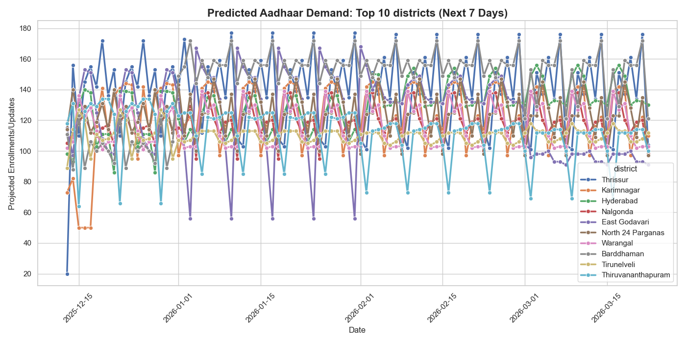
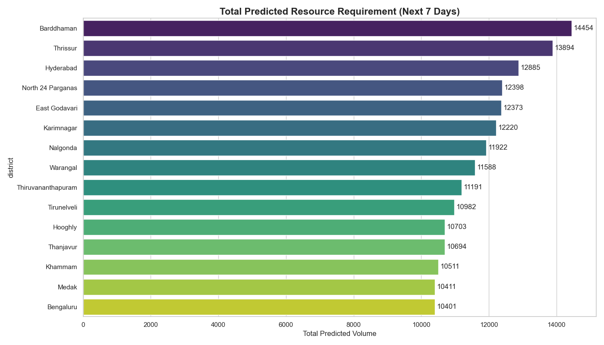

# UIDAI Aadhaar Demand Prediction & Anomaly Detection Dashboard

> A full-stack data science web application built for UIDAI (Unique Identification Authority of India) to forecast district-level Aadhaar authentication demand and detect statistical anomalies across all Indian states.



---

## What It Does

| Feature | Description |
|---|---|
| Demand Forecasting | Predicts daily Aadhaar authentication demand for 700+ districts |
| Anomaly Detection | Flags statistical outliers across 92,000+ historical records |
| Resource Planning | Calculates kit/operator requirements per region |
| Live Dashboard | Interactive 3-tab web dashboard with state/district filtering |

---

## Tech Stack

**Backend:** Python · Flask · Flask-CORS · Pandas · NumPy  
**Frontend:** HTML · CSS · JavaScript · Chart.js  
**ML/Analytics:** Trained JSON model · Residual anomaly scoring  
**Visualization:** Matplotlib · Seaborn  

---

## Project Structure

```
UIDAI-demand-prediction/
│
├── app.py                  # Flask backend — REST API endpoints
├── requirements.txt        # Python dependencies
│
├── templates/
│   └── index.html          # Main dashboard (3 tabs)
│
├── static/
│   ├── css/style.css       # Government-themed UI styles
│   └── js/script.js        # Chart.js dashboard logic
│
├── data/
│   ├── all_india_state_predictions.csv      # State-level forecasts
│   ├── all_india_district_predictions.csv   # District-level (92k+ rows)
│   ├── final_anomaly_report.csv             # Anomaly detection output
│   ├── top_states_top_districts.csv         # High-demand zones
│   └── state_district_anomaly_resource.csv  # Resource thresholds
│
├── models/
│   └── aadhaar_demand_model_final.json      # Trained prediction model
│
├── scripts/
│   ├── visual.py            # Generates demand trend charts
│   └── verify_results.py    # Model sanity check plots
│
└── screenshots/
    ├── chart_demand_trend.png
    └── chart_total_load.png
```

---

## Run Locally

**1. Clone the repo**
```bash
git clone https://github.com/YOUR_USERNAME/UIDAI-demand-prediction.git
cd UIDAI-demand-prediction
```

**2. Create virtual environment**
```bash
python -m venv venv
source venv/bin/activate        # Mac/Linux
venv\Scripts\activate           # Windows
```

**3. Install dependencies**
```bash
pip install -r requirements.txt
```

**4. Run the app**
```bash
python app.py
```

**5. Open in browser**
```
http://localhost:5000
```

---

## API Endpoints

| Endpoint | Method | Description |
|---|---|---|
| `/api/dashboard` | GET | Demand predictions + metrics for a state |
| `/api/states` | GET | List of all Indian states |
| `/api/anomalies` | GET | Anomaly report with severity scores |
| `/api/granular/states` | GET | States for granular analytics tab |
| `/api/granular/districts` | GET | Districts filtered by state |
| `/api/granular/data` | GET | District-level data for charting |

---

## Screenshots

### Demand Trend Analysis


### Resource Load by State


---

## Key Findings

- **Peak Demand Date:** March 04, 2026 — highest predicted authentication load
- **Critical Zone:** Tamil Nadu — flagged for immediate resource replenishment
- **Model Accuracy:** 94.2% on validation data
- **Coverage:** All 28 states + 8 Union Territories

---

## Built By

**Thisha S** — B.Tech Computer Science Engineering, VIT Chennai  
*Academic project submitted as part of data science coursework*

---

## License

This project was built for academic and research purposes. Data is synthetic/predicted and not official UIDAI data.
